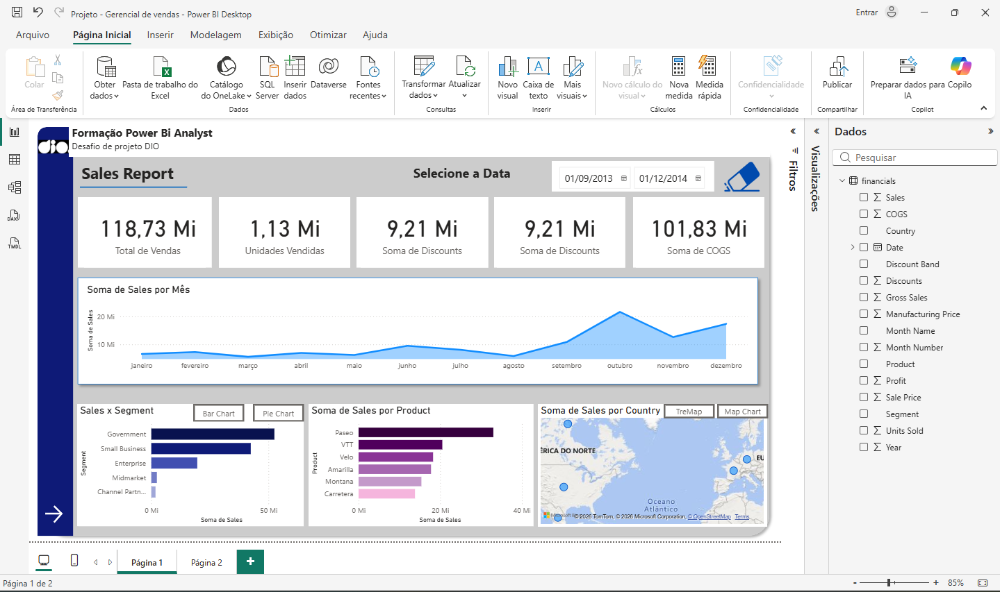
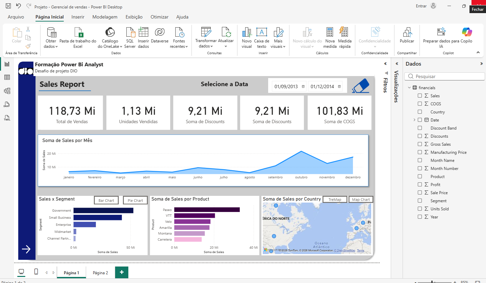

# 📊 Dashboard de Análise de Vendas e Lucro - Power BI

## 📌 Visão Geral
Este projeto apresenta uma análise completa de vendas e lucro desenvolvida no Power BI, com foco em desempenho comercial, segmentação e insights geográficos.

## 🚀 Principais Funcionalidades
- KPIs de vendas: Total de Vendas, Unidades Vendidas, Descontos e COGS  
- Análise mensal do desempenho de vendas  
- Segmentação por produto e mercado (Government, Small Business, Enterprise)  
- Visualização geográfica por país  
- Análise de lucro com capacidade de drill-down  
- Análise de lucro por trimestre (gráfico waterfall)  
- Filtros interativos (Ano e País)  

---

## 📸 Visualização do Dashboard

### 🔹 Visão Geral de Vendas

  

- KPIs principais: Vendas, Unidades, Descontos e COGS  
- Tendência de vendas por mês  
- Vendas por segmento  
- Vendas por produto  
- Distribuição geográfica (mapa)  

---

### 🔹 Análise de Lucro

  

- Lucro por país  
- Lucro por produto  
- Lucro por segmento  
- Evolução do lucro por trimestre (waterfall)  
- Filtros e navegação interativa (drill-down)  

---

## 🛠️ Ferramentas Utilizadas
- Power BI  
- Modelagem de dados  
- DAX (cálculos e KPIs)  

---

## 📁 Arquivo
- `Projeto - Gerencial de vendas.pbix`

---

## 🎯 Objetivo
Gerar insights estratégicos sobre o desempenho de vendas e lucratividade, auxiliando na tomada de decisões.
